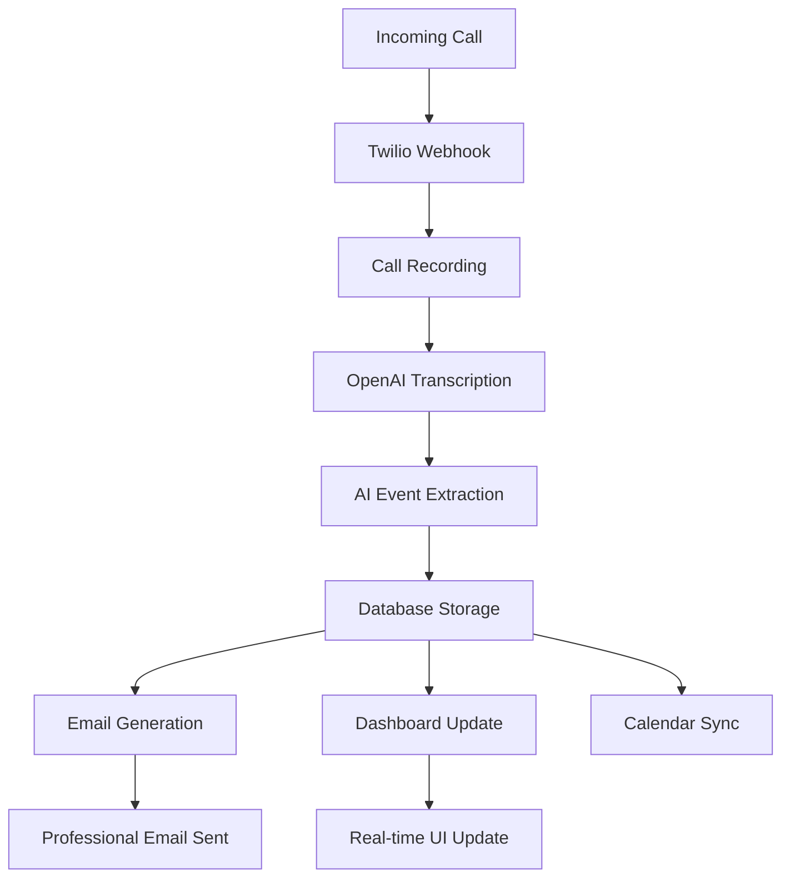

# Flynn.ai v2 - Universal AI Call-to-Calendar Platform

<div align="center">


**Transform business phone calls into organized calendar events with AI-powered event extraction**

[](LICENSE)
[](https://www.typescriptlang.org/)
[](https://nextjs.org/)
[](https://supabase.com/)

</div>

## 🚀 Overview

Flynn.ai v2 is a universal AI platform that processes business phone calls and automatically creates calendar appointments. It serves professionals across all industries - from plumbers and real estate agents to lawyers and consultants - with a flexible event system that adapts to each business context.

### Key Features

- **🎯 Universal Industry Support**: Adapts to plumbing, real estate, legal, medical, sales, consulting, and more
- **🤖 AI-Powered Event Extraction**: Uses OpenAI GPT-4 to extract events, appointments, and commitments from call transcripts
- **📧 Professional Email Delivery**: Sends call overviews with extracted events within 2 minutes
- **📅 Universal Calendar Sync**: Integrates with Google Calendar, Outlook, Apple Calendar, and ICS files
- **📱 Mobile-First Dashboard**: Responsive web interface for managing events on any device
- **⚡ Real-Time Processing**: Live updates via Supabase Realtime
- **🔧 Flexible Event System**: Not just "appointments" - handles quotes, consultations, emergencies, and more

## 🏗️ Architecture

### Technology Stack

- **Frontend**: Next.js 14 with TypeScript and Tailwind CSS
- **Backend**: Next.js API Routes with App Router
- **Database**: Supabase (PostgreSQL) with Row Level Security
- **Authentication**: Supabase Auth
- **AI Processing**: OpenAI GPT-4 and Whisper API
- **Voice Processing**: Twilio Voice API with Media Streams
- **Email**: React Email with Resend delivery
- **Calendar**: Google Calendar API, Microsoft Graph API, ICS generation
- **Testing**: Jest, Playwright, React Testing Library

### System Flow



## 📋 Prerequisites

Before you begin, ensure you have the following:

- **Node.js** 18.0 or later
- **npm** or **yarn** package manager
- **Git** for version control

### Required API Keys

- **Supabase**: Database and authentication
- **OpenAI**: AI processing (GPT-4 + Whisper)
- **Twilio**: Voice API for call handling
- **Resend**: Email delivery service
- **Google Calendar API** (optional): Calendar integration
- **Microsoft Graph API** (optional): Outlook integration

## 🚀 Quick Start

### 1. Clone the Repository

```bash
git clone https://github.com/your-username/flynnv2.git
cd flynnv2
```

### 2. Install Dependencies

```bash
npm install
```

### 3. Environment Setup

Copy the environment template and fill in your API keys:

```bash
cp .env.example .env.local
```

Edit `.env.local` with your configuration:

```env
# Supabase Configuration
NEXT_PUBLIC_SUPABASE_URL=your_supabase_project_url
NEXT_PUBLIC_SUPABASE_ANON_KEY=your_supabase_anon_key
SUPABASE_SERVICE_ROLE_KEY=your_supabase_service_role_key

# OpenAI Configuration
OPENAI_API_KEY=your_openai_api_key

# Twilio Configuration
TWILIO_ACCOUNT_SID=your_twilio_account_sid
TWILIO_AUTH_TOKEN=your_twilio_auth_token
TWILIO_WEBHOOK_SECRET=your_twilio_webhook_secret

# Email Configuration
RESEND_API_KEY=your_resend_api_key
EMAIL_DOMAIN=your_domain.com

# Calendar Integration (Optional)
GOOGLE_CLIENT_ID=your_google_client_id
GOOGLE_CLIENT_SECRET=your_google_client_secret
MICROSOFT_CLIENT_ID=your_microsoft_client_id
MICROSOFT_CLIENT_SECRET=your_microsoft_client_secret

# Application URLs
NEXT_PUBLIC_APP_URL=http://localhost:3000
```

### 4. Database Setup

Initialize your Supabase database:

```bash
# Install Supabase CLI
npm install -g @supabase/cli

# Initialize Supabase (optional - for local development)
supabase init

# Apply database schema
supabase db reset
```

Or manually apply the schema from `DATABASE.md` to your Supabase project.

### 5. Start Development Server

```bash
npm run dev
```

Your app will be available at `http://localhost:3000`

## 📖 Documentation

Comprehensive documentation is available in the following files:

- **[TASKS.md](./TASKS.md)** - Complete development roadmap with 25 detailed tasks
- **[DATABASE.md](./DATABASE.md)** - Database schema and Supabase setup
- **[API_STRUCTURE.md](./API_STRUCTURE.md)** - API endpoints and integration guide
- **[AI_EXTRACTION.md](./AI_EXTRACTION.md)** - AI processing and prompt engineering
- **[EMAIL_TEMPLATES.md](./EMAIL_TEMPLATES.md)** - Email system and React Email templates
- **[CALENDAR_INTEGRATION.md](./CALENDAR_INTEGRATION.md)** - Calendar sync implementation
- **[TESTING_STRATEGY.md](./TESTING_STRATEGY.md)** - Testing approach and test scenarios
- **[INDUSTRY_CONFIGURATIONS.md](./INDUSTRY_CONFIGURATIONS.md)** - Industry-specific configurations

## 🏭 Industry Support

Flynn.ai v2 supports multiple industries with tailored configurations:

### Supported Industries

| Industry | Event Types | Key Features |
|----------|-------------|--------------|
| **Plumbing** | Service calls, emergencies, quotes | Emergency detection, location tracking |
| **Real Estate** | Showings, meetings, inspections | Property address extraction, buyer qualification |
| **Legal** | Consultations, court dates | Deadline detection, confidentiality handling |
| **Medical** | Appointments, follow-ups | HIPAA compliance, urgency assessment |
| **Sales** | Demos, discovery calls | Lead qualification, pipeline tracking |
| **Consulting** | Strategy sessions, workshops | Project scope identification |

### Adaptive Features

- **Industry-Specific Terminology**: "Service call" vs "appointment" vs "consultation"
- **Event Type Classification**: Automatically categorizes based on industry context
- **Urgency Detection**: Industry-aware priority assessment
- **Business Hours**: Configurable operating hours per industry
- **Email Templates**: Professional templates adapted for each industry

## 🎯 Core Features

### AI Event Extraction

```typescript
// Example: AI extracts multiple events from a single call
const callTranscript = `
  Hi, my kitchen sink is leaking and I need it fixed tomorrow morning. 
  Also, can you come back next week to install the new water heater we discussed? 
  My address is 123 Oak Street.
`;

// AI Output:
[
  {
    eventType: "service_call",
    title: "Kitchen Sink Repair",
    proposedDateTime: "2025-01-16T09:00:00Z",
    location: "123 Oak Street",
    urgencyLevel: "high"
  },
  {
    eventType: "service_call", 
    title: "Water Heater Installation",
    proposedDateTime: null, // Needs follow-up
    location: "123 Oak Street",
    followUpRequired: true
  }
]
```

### Professional Email System

Automatically sends professional emails with:
- **AI-generated subject lines** based on call content
- **Event cards** with confirmation/edit buttons
- **Calendar attachments** (ICS files)
- **Deep links** to dashboard for editing
- **Industry-appropriate** language and formatting

### Flexible Event Management

Events can be:
- ✅ **Confirmed** - User verified and committed
- ⏳ **Pending** - Needs user review or callback  
- 📝 **Extracted** - AI found potential event
- 🔄 **Follow-up** - Requires additional contact
- ✅ **Completed** - Event finished
- ❌ **Cancelled** - Event cancelled

### Dashboard Features

- **Real-time updates** as calls are processed
- **Bulk event management** for efficient workflow
- **Calendar conflict detection** before scheduling
- **Customer communication** tools
- **Analytics and reporting** on conversion rates

## 🔧 Development

### Project Structure

```
flynnv2/
├── app/                    # Next.js 14 App Router
│   ├── (auth)/            # Authentication routes
│   ├── (dashboard)/       # Dashboard pages
│   ├── api/               # API endpoints
│   │   ├── webhooks/      # Twilio webhooks
│   │   ├── events/        # Event management
│   │   ├── calendar/      # Calendar integration
│   │   └── emails/        # Email sending
│   ├── layout.tsx         # Root layout
│   └── page.tsx           # Landing page
├── components/            # React components
│   ├── ui/               # Shared UI components
│   ├── dashboard/        # Dashboard-specific components
│   ├── email-templates/  # React Email templates
│   └── calendar/         # Calendar components
├── lib/                  # Core business logic
│   ├── ai/              # AI processing
│   ├── calendar/        # Calendar integrations
│   ├── email/           # Email system
│   ├── industry/        # Industry configurations
│   └── supabase/        # Database utilities
├── utils/               # Utility functions
│   └── supabase/        # Supabase client setup
├── types/               # TypeScript type definitions
├── hooks/               # Custom React hooks
└── middleware.ts        # Next.js middleware
```

### Development Scripts

```bash
# Development
npm run dev              # Start development server
npm run build           # Build for production
npm run start           # Start production server

# Testing
npm run test            # Run unit tests
npm run test:watch      # Run tests in watch mode
npm run test:e2e        # Run end-to-end tests
npm run test:coverage   # Generate coverage report

# Database
npm run db:reset        # Reset local database
npm run db:migrate      # Run database migrations
npm run db:seed         # Seed test data

# Linting & Formatting
npm run lint            # Run ESLint
npm run lint:fix        # Fix ESLint issues
npm run typecheck       # Run TypeScript checks
```

### Key Development Commands

```bash
# Set up Twilio webhook tunnel for local development
ngrok http 3000
# Then update Twilio webhook URL to: https://your-ngrok-url.ngrok.io/api/webhooks/twilio/voice

# Generate Supabase types
npx supabase gen types typescript --project-id YOUR_PROJECT_ID > types/database.types.ts

# Test email templates
npm run email:preview   # Opens email template preview server
```

## 🧪 Testing

### Test Coverage Goals

- **90%+ coverage** for core business logic
- **Industry-specific scenarios** for all supported business types
- **End-to-end workflows** from call to calendar sync
- **Performance testing** for AI processing
- **Security testing** for API endpoints

### Running Tests

```bash
# Unit tests
npm run test

# Integration tests  
npm run test:integration

# End-to-end tests
npm run test:e2e

# Performance tests
npm run test:performance

# Test specific industry
npm run test -- --testPathPattern=plumbing
```

## 🚀 Deployment

### Production Deployment

1. **Environment Variables**: Set up all production environment variables
2. **Database**: Configure production Supabase project with schema
3. **Domain Setup**: Configure custom domain for email sending
4. **Webhook URLs**: Update Twilio webhook URLs to production endpoints
5. **API Limits**: Configure rate limiting and usage monitoring

### Recommended Hosting

- **Vercel** (recommended for Next.js)
- **Netlify**
- **Railway**
- **Self-hosted** with Docker

### Docker Deployment

```bash
# Build Docker image
docker build -t flynnv2 .

# Run container
docker run -p 3000:3000 --env-file .env.production flynnv2
```

## 📊 Performance Benchmarks

### Target Metrics

- **< 2 minutes**: Call processing to email delivery
- **90%+ accuracy**: AI event extraction
- **< 1 second**: Dashboard load time
- **99.9% uptime**: Service availability
- **< 500ms**: API response time

### Monitoring

The application includes built-in monitoring for:
- AI processing accuracy and speed
- Email delivery rates
- Calendar sync success rates
- User engagement metrics
- System performance metrics

## 🔐 Security

### Security Features

- **Row Level Security** on all database tables
- **API key encryption** for third-party services
- **Webhook signature verification** for Twilio
- **Rate limiting** on all API endpoints
- **Input validation** using Zod schemas
- **CORS configuration** for secure client access

### Privacy Considerations

- **No sensitive data storage** in logs
- **HIPAA compliance** considerations for medical industry
- **PII encryption** for customer information
- **User data control** with easy deletion

## 🤝 Contributing

We welcome contributions! Please read our [Contributing Guidelines](CONTRIBUTING.md) before submitting pull requests.

### Development Process

1. Fork the repository
2. Create a feature branch (`git checkout -b feature/amazing-feature`)
3. Make your changes
4. Add tests for new functionality
5. Ensure all tests pass (`npm run test`)
6. Commit changes (`git commit -m 'Add amazing feature'`)
7. Push to branch (`git push origin feature/amazing-feature`)
8. Open a Pull Request

### Code Standards

- **TypeScript** for type safety
- **ESLint + Prettier** for code formatting
- **Jest** for unit testing
- **Playwright** for E2E testing
- **Conventional Commits** for commit messages

## 📝 Changelog

### Version 2.0.0 (In Development)

**New Features:**
- ✨ Universal industry support with flexible event system
- 🤖 Advanced AI event extraction with industry awareness
- 📧 Professional email templates with React Email
- 📅 Universal calendar integration (Google, Outlook, Apple)
- 📱 Mobile-first responsive design
- ⚡ Real-time dashboard updates

**Breaking Changes:**
- 🔄 Migrated from "appointments" to flexible "events" system
- 📊 New database schema with industry configurations
- 🎯 Industry-specific AI prompts and terminology

## 📄 License

This project is licensed under the MIT License - see the [LICENSE](LICENSE) file for details.

## 🆘 Support

### Documentation

- [API Documentation](./API_STRUCTURE.md)
- [Database Schema](./DATABASE.md)
- [Development Guide](./TASKS.md)

### Community

- **GitHub Issues**: Bug reports and feature requests
- **Discussions**: Community questions and support
- **Email**: support@flynn.ai for enterprise support

### Professional Services

Flynn.ai offers professional services for:
- Custom industry configurations
- Enterprise deployment
- Advanced integrations
- Training and consulting

Contact: enterprise@flynn.ai

---

<div align="center">

**Made with ❤️ by the Flynn.ai Team**

[Website](https://flynn.ai) • [Documentation](./TASKS.md) • [API Reference](./API_STRUCTURE.md)

</div># flynnaiv2
